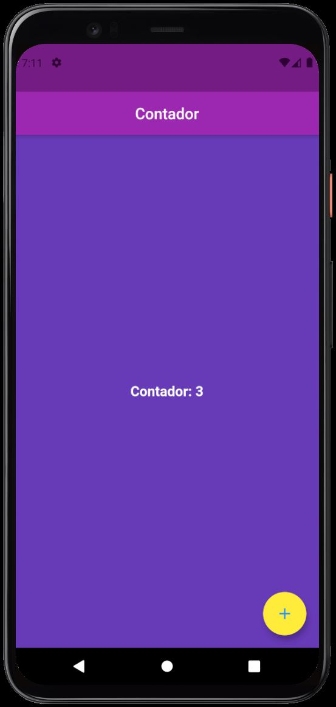

# Counter - [](https://flutter.dev/)

<h1 align="center">
  <p>A simple Flutter App - Counter</p>
  
</h1>

# Features

## Getting Started

- Clone the repository
- run in cmd:
  ```cmd
  flutter pub get
  flutter run
  ```

## Dependencieis

| Lib     | Link                    |
| ------- | ----------------------- |
| no libs | [lib](https://pub.dev/) |

## Device

- Tested in Pixel 4 - Android 11
